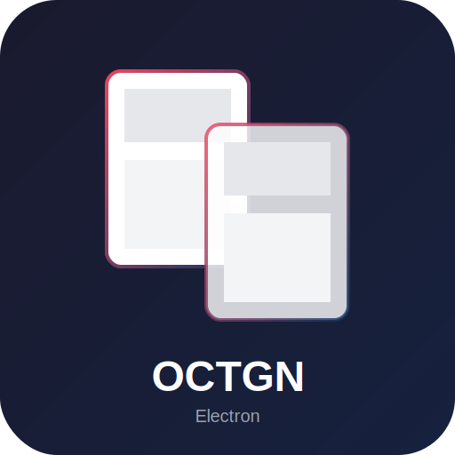

# OCTGN Electron Client

Cross-platform Electron client for OCTGN (Online Card and Tabletop Gaming Network).



## Features

- 🎮 **Game Table**: Interactive canvas-based game table with pan/zoom
- 🃏 **Deck Editor**: Build and manage your decks with card sections
- 📦 **Game Library**: Browse and install card games
- 💬 **Chat**: In-game chat support
- 🌍 **Cross-Platform**: Windows, macOS, and Linux
- 🔌 **Protocol Compatible**: Works with existing OCTGN clients

## Quick Start

```bash
# Clone the repository
git clone https://github.com/octgn/OCTGN.git
cd OCTGN/octgn-electron

# Install dependencies
npm install

# Start development server
npm run dev

# Build for production
npm run build

# Package for distribution
npm run dist
```

## Architecture

### Frontend (Electron + React + Tailwind)
- **React 18** with hooks and Zustand state management
- **Tailwind CSS** for styling
- **Canvas 2D** for game table rendering
- **WebSocket** for realtime communication

### Backend (Node.js + TypeScript)
- TCP game server compatible with existing clients
- Binary protocol implementation (110+ methods)
- Game state management and synchronization
- Player connection handling

### Project Structure
```
octgn-electron/
├── electron/           # Main process code
│   ├── main.ts         # Electron entry point
│   ├── preload.ts      # Context bridge
│   └── server/         # Game server
│       ├── GameServer.ts
│       ├── GameClient.ts
│       ├── GameState.ts
│       ├── Player.ts
│       ├── BinaryProtocol.ts
│       └── WebSocketBridge.ts
│
├── src/                # Renderer process
│   ├── components/     # React components
│   ├── pages/          # Route pages
│   ├── stores/         # Zustand stores
│   ├── hooks/          # Custom hooks
│   ├── types/          # TypeScript types
│   └── utils/          # Utilities
│
└── build/              # Build resources
```

## Components

### Game Components
- **GameCanvas**: Canvas-based table rendering
- **Card**: Card display with face up/down, markers, highlights
- **CardPile**: Stacked/fanned card groups
- **PlayerHand**: Fan-style hand display
- **CardZoom**: Hover card preview

### UI Components
- **Layout**: Main app layout with sidebar
- **Modal**: Dialog component
- **Button**: Styled button with variants
- **ContextMenu**: Right-click menu with submenus
- **PlayerList**: Connected players display
- **TurnIndicator**: Turn and phase tracking
- **CounterPanel**: Game counter management

### Dialogs
- **HostGameModal**: Game hosting configuration
- **JoinGameModal**: Server connection dialog

## Utilities

### deckParser
Parse and serialize OCTGN deck files (.o8d)

```typescript
import { parseDeck, serializeDeck } from './utils';

const deck = parseDeck(xmlString);
const xml = serializeDeck(deck);
```

### soundManager
Audio playback with generated placeholder sounds

```typescript
import { soundManager } from './utils';

soundManager.play('cardflip');
soundManager.play('shuffle');
```

### gamePackage
Load and parse game definition files (.o8g)

```typescript
import { parseGameDefinition } from './utils';

const gameDef = parseGameDefinition(xmlString);
```

### GameStateSerializer
Save and load game state

```typescript
import { GameStateSerializer } from './utils';

await GameStateSerializer.saveToFile(data);
const state = await GameStateSerializer.loadFromFile();
```

### TableRenderer
Canvas-based table rendering

```typescript
import { TableRenderer } from './utils';

const renderer = new TableRenderer(ctx);
renderer.renderBackground(panOffset, zoom);
renderer.renderCard(card, panOffset, zoom, isSelected, isHovered);
```

## Hooks

### useGameClient
React hook for game server communication

```typescript
const { connected, connect, sendChat, moveCards } = useGameClient({
  onChat: (data) => { },
  onPlayerJoined: (data) => { },
});
```

### useKeyboardShortcuts
Global keyboard shortcut handling

```typescript
useKeyboardShortcuts([
  { key: 'f', action: () => flipCards() },
  { key: 'r', action: () => rotateCards() },
]);
```

### useCardSelection
Card selection with click/shift-click/box

```typescript
const { selectedIds, handleCardClick, clearSelection } = useCardSelection(cards);
```

## Protocol

This client implements the OCTGN binary wire protocol for compatibility:
- Message format: `[4-byte length][4-byte muted][1-byte method][args...]`
- All 110+ protocol methods defined
- BinaryReader/BinaryWriter helper classes

### Supported Methods
- Card operations: Move, Turn, Rotate, Target, Highlight
- Deck operations: Load, Shuffle
- Player operations: Join, Leave, Ready
- Game operations: Start, Reset, NextTurn, SetPhase
- Communication: Chat, Print

## Building

### Prerequisites
- Node.js 18+
- npm 9+

### Development
```bash
npm run dev
```

### Production Build
```bash
# Build renderer and main process
npm run build

# Package for current platform
npm run pack

# Create distributable
npm run dist

# Platform-specific builds
npm run dist:linux
npm run dist:mac
npm run dist:win
```

### Build Output
- **Windows**: NSIS installer, portable executable
- **macOS**: DMG, ZIP (x64, arm64)
- **Linux**: AppImage, DEB, tar.gz

## Configuration

### Environment Variables
```
VITE_APP_TITLE=OCTGN
VITE_WS_BRIDGE_PORT=8889
```

### Electron Builder
See `electron-builder.yml` for build configuration.

## Keyboard Shortcuts

| Key | Action |
|-----|--------|
| F | Flip selected cards |
| R | Rotate selected cards 90° |
| Delete | Delete selected cards |
| H | Toggle hand visibility |
| C | Toggle chat visibility |
| Ctrl+S | Save game |
| Ctrl+O | Load game |
| Ctrl++ | Zoom in |
| Ctrl+- | Zoom out |
| Ctrl+0 | Reset zoom |
| Escape | Clear selection |

## License

AGPL-3.0

## Credits

- OCTGN Community
- Based on [OCTGN](https://github.com/octgn/OCTGN)

## Contributing

1. Fork the repository
2. Create a feature branch
3. Make your changes
4. Submit a pull request

---

*Built with ❤️ by the OCTGN community*
